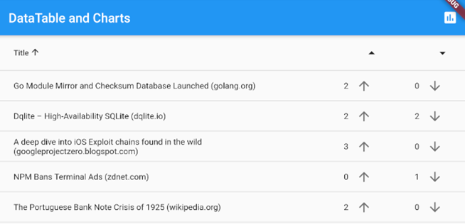
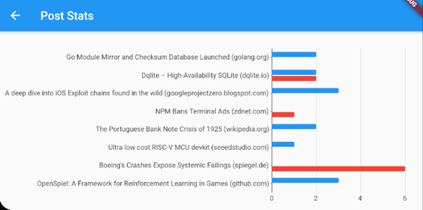

# Lab 08
The starter code for lab 08.

## Overview
For this lab, you will develop a rudimentary social network, roughly modelled after _Hacker News_ (https://news.ycombinator.com/).  The app will display a sortable `DataTable` of stories with their up votes and down votes, as well as icon buttons allowing the user to increase the number of up/down votes.

_**Note:**  The user will be able to press the up arrow or down arrow icon as many times as they like.  We're not keeping track of which users have voted already._

## Instructions

### The Post Class and Sample Data
The Post class will consist of the following fields:
- `title` (`String`)
- `numUpVotes` (`int`)
- `numDownVotes` (`int`)

This class will also have a static function (`generateData()`) which will return some (5-10) sample `Post`s.

### Creating the DataTable
The `DataTable` will consist of three columns:
- `title` (not numeric)
- `numUpVotes` (numeric)
- `numDownVotes` (numeric)

This `DataTable` will be similar to the in-class demo, but will not support selection or editing.  It will support sorting on all three columns, however.  The data for this table will be taken from the `generateData()` method on the `Post` class.

The `title` column will merely display a simple `Text` widget.  The other two columns will generate both a `Text` widget (to display the current value), and an `IconButton` (to allow the user to change the value).  A screenshot of the desired table appearance, is shown below:

_Figure 1 - The DataTable_

Please note the app bar at the top, which has a chart icon to take you to the chart page (described in the next section).

### The Chart
The widget containing the `DataTable` will pass its post data to this widget, as an argument.  This widget will generate a horizontal bar chart with two series:
- up votes
- down votes

The post's title will be used as the domain for both series.  A screenshot of the desired chart is shown below:

 
_Figure 2 - The bar chart_

## Getting Help
If you run into difficulty, you may wish to check out some of the following resources:

- https://api.flutter.dev/  - The standard documentation for Flutter, all classes and methods.
- https://dart.dev/tutorials - A series of tutorials for the Dart programming language, focusing entirely on the features of Dart.
- https://flutter.dev/docs/reference/tutorials - A series of tutorials for the Flutter platform, focusing mainly on the widgets and API.
- https://flutter.dev/docs/codelabs - A series of deep-dive, more comprehensive, tutorials to learn more about the Flutter platform.
- https://flutter.dev/docs/cookbook - A set of recipes for commonly used features of Flutter.
- https://github.com/flutter/samples/ - A repository containing some completed Flutter applications.
- http://stackoverflow.com/ - A forum for asking questions about programming.  I bet you know this one already!

Of course, you can always ask the TA for help!  However, learning how to find the answers out for yourself is not only more satisfying, but results in greater learning as well.

## How to Submit
Create your flutter project inside this folder, commit, and then push your code to this repository to submit your lab assignment.

## Extending
To extend this lab, you will need to modify both the DataTable page and the chart page:

- (3 marks) Modify the lab so that the data source is SQLite. The database will need to store the title and number of upvotes and downvotes for each post, and modify these values when changed. 

- (2 marks) Add a Floating Action button to the DataTable page to enable users to add new posts. A new post will have 0 upVotes and 0 downVotes. Don't forget to add it to the database as well!

- (2 marks) Modify the chart page to allow the user to switch between visualizing the data with a horizontal bar chart, a vertical stacked bar chart, or two pie charts (one for upvotes, one for downvotes).

- (2 marks) Add a URL field to the Post class. Then modify the table to use hyperlinks, so that users can tap on a story to open that URL in a web browser. 

- (2 marks) Add an icon to the appBar to allow users to add a large number of new posts by importing a .csv file. The csv file should have 3 columns (title, numUpVotes, numDownVotes). Ensure this data is also added successfully to the database.

- (4 marks) Add two more features of your choice other than those listed here. Mention these features explicitly in your README.md.

  - As a baseline, these features should be at least as complex as being able to create a comment thread under any post, where the user can write and post comments which can also be voted on, but do not appear in the charts.
